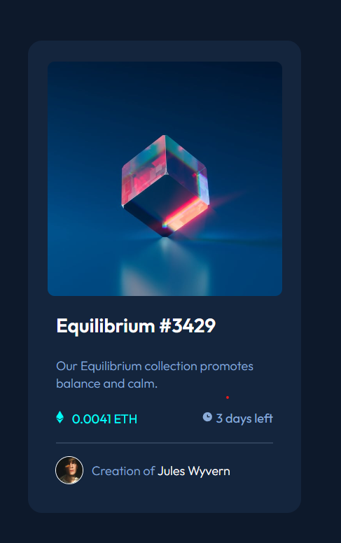

# Frontend Mentor - NFT preview card component solution

This is a solution to the [NFT preview card component challenge on Frontend Mentor](https://www.frontendmentor.io/challenges/nft-preview-card-component-SbdUL_w0U). Frontend Mentor challenges help you improve your coding skills by building realistic projects.

## Table of contents

- [Overview](#overview)
  - [The challenge](#the-challenge)
  - [Screenshot](#screenshot)
  - [Links](#links)
- [My process](#my-process)
  - [Built with](#built-with)
  - [What I learned](#what-i-learned)
- [Author](#author)

## Overview

### The challenge

Users should be able to:

- View the optimal layout depending on their device's screen size
- See hover states for interactive elements

### Screenshot



### Links

- Solution URL: (https://your-solution-url.com)
- Live Site URL: (https://your-live-site-url.com)

## My process

### Built with

- Semantic HTML5 markup
- CSS custom properties
- Flexbox
- [React](https://reactjs.org/) - JS library
- [Next.js](https://nextjs.org/) - React framework

### What I learned

This is my second react project. I am very proud of what I did here. I did not just hardcoded the informationon to the Nft preview card, I made it easy to change eny information from author name, price, cryptocurrency to image.

```js
export default function App() {
  return (
    <div>
      <Card
        id="3429"
        title="Equilibrium"
        description="Our Equilibrium collection promotes balance and calm."
        img={img} //path to img
        price="0.0041"
        coin="ETH"
        simbol={simbol} //path to simbol of the currency
        time="3 days"
        authorname="Jules Wyvern"
        authorimg={avatar} //path to author foto
      />
      <Footer />
    </div>
  );
}
```

## Author

- Website - [Barna iustin]( coming soon ... idk)
- Frontend Mentor - [@Iustin117](https://www.frontendmentor.io/profile/Iustin117)
